# Energy consumption visualization

Renders **ranking** and **comparison** plots as SVG and PNG from a time window of history, triggered by an IO source.

## How it works


In **service** mode each channel thread blocks on the IO source, waits until every configured site has arrived (a barrier), then processes one round.
With **`--one-shot`**, each channel runs once using `datetime.now()` as the window end and the process exits.

## History providers and IO sources



Data acquisition is done with the help of an IO source and a history provider:

- **IO source**:
  Listens for new samples per site. Waits until new samples from every configured site have arrived (multi-site barrier), then starts a processing round.
- **History provider**:
  Retrieve samples for the interval `[end - history_window, end]` from a database.
  Optionally, sample quality is reported as `measured`, `imputed`, or `forecast` in case a corresponding quality series exists.
  If a query returns no samples, the fetch is retried according to `retry_n` and `retry_wait_s` on that provider's config.

**Current status:**
[TimescaleDB](https://timescaledb.org/) for history, [Redis](https://redis.io/) streams for IO.
The stream name is `stream_template` with `{site_id}` filled in; the client starts at the current stream tip and `XREAD`s new entries.
Further backends (HTTP/REST) are planned; they are not implemented yet.

## Requirements

- Python `>=3.13,<4.0`
- [uv](https://docs.astral.sh/uv/)
- Git dependency `pyrdp-commons`
- history backend & IO source (currently TimescaleDB & Redis)
- SVG template files on disk

## Install and run

```bash
uv sync --group dev
uv run python -m energy_consumption_visualization -c config.yml
uv run python -m energy_consumption_visualization -c config.yml --one-shot
```

Default config path is `config.yml`.
YAML is loaded with environment expansion (`${REDIS_PASSWORD}`, `${POSTGRES_USER}`, etc.).

## Configuration

Top-level keys: `channels`, `redis`, `timescale`, `logging`.

Per channel:

- `sites`: each entry has `id`, `label`, and a positive `n_apartments`
- `stream_template`: Redis stream pattern with `{site_id}`
- `history_window`: duration (`ms`, `s`, `m`, `h`, `d`, `w`; bare numbers are seconds)
- `history_provider`: datapoint identity for the channel series (`dp_name` plus optional `dp_unit`, `dp_data_provider`, `dp_device_id`, `dp_location_code`); optional retry on empty results (`retry_n` with default `0`, `retry_wait_s` with default `5`)
- optional `ranking` and/or `compare`

Colors are names from [`energy_consumption_visualization/render/colors.py`](energy_consumption_visualization/render/colors.py) (`deep teal`, `golden amber`, `terracotta`, etc.).
Output paths interpolate `{date}`, `{site_id}`, `{measurement}`, and `{ext}`.

Full example: [docs/example-config.md](docs/example-config.md).
Field contract: [`energy_consumption_visualization/config.py`](energy_consumption_visualization/config.py).

## SVG templates

`template_path` must exist.
Slots are leaf shapes (`rect`, `path`, etc.) with matching `id`s and a positive bounding box.
Groups with children are not supported as slots.

- **Ranking** needs title, chart, and ranking-table slots (`title_slot`, `chart_slot`, `ranking_slot`).
- **Compare** needs title, the main chart slot, and one slot per `against` series.

Simple example: [docs/example-template.md](docs/example-template.md).

## Development

Package code lives in `energy_consumption_visualization/`.
Tests live in `test/`.

```bash
uv run pytest test
```

## Funding acknowledgement

This development has been supported by the [CELINE] project of the European Union’s research and innovation programme Horizon Europe under the grant agreement No.101160667.

[CELINE]: https://www.celineproject.eu/
